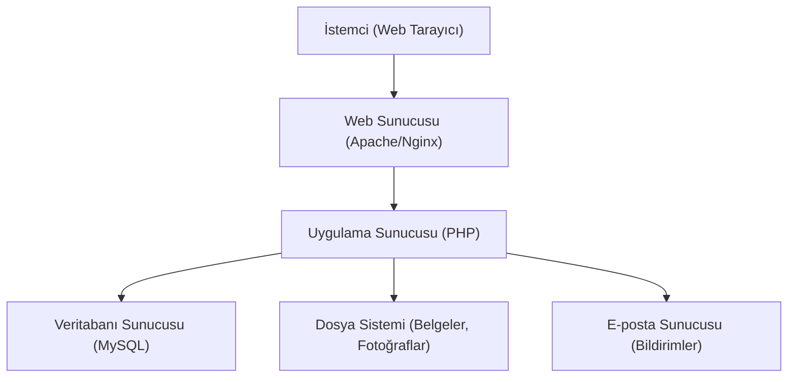

### E-Okul Veli Bilgilendirme Sistemi - YBS Tasarım Projesi

Bu repo, Yönetim Bilişim Sistemi (YBS) Tasarım Projesi kapsamında geliştirilen E-Okul Veli Bilgilendirme Sistemi'nin dokümentasyonunu içermektedir.

## İçindekiler

- [Proje Hakkında](#proje-hakkında)
- [Sistem Tanıtımı](#sistem-tanıtımı)
- [Mevcut Sistemin İncelenmesi](#mevcut-sistemin-incelenmesi)
- [Problemler ve İhtiyaçlar](#problemler-ve-ihtiyaçlar)
- [Önerilen Sistem](#önerilen-sistem)

- [Kaba İlişki Diyagramı](#kaba-ilişki-diyagramı)
- [0-Seviye Diyagramı](#0-seviye-diyagramı)
- [Alt Seviye Diyagramlar](#alt-seviye-diyagramlar)
- [Yapısal Dil Örnekleri](#yapısal-dil-örnekleri)


- [Birim İlişki Diyagramı (ERD)](#birim-ilişki-diyagramı-erd)
- [Veritabanı Tasarımı](#veritabanı-tasarımı)
- [Ekran Tasarımları](#ekran-tasarımları)
- [Kurulum ve Kullanım](#kurulum-ve-kullanım)
- [Katkıda Bulunanlar](#katkıda-bulunanlar)


## Proje Hakkında

E-Okul Veli Bilgilendirme Sistemi, öğrencilerin akademik performansını, devam durumunu ve diğer okul aktivitelerini velilerin ve öğrencilerin takip edebilmesini sağlayan bir yönetim bilişim sistemidir. Bu sistem, okul yönetimi, öğretmenler, öğrenciler ve veliler arasında etkin bir iletişim kanalı oluşturmayı amaçlamaktadır.

## Sistem Tanıtımı

```mermaid
Genel Sistem İçerisindeki Yeri.download-icon {
            cursor: pointer;
            transform-origin: center;
        }
        .download-icon .arrow-part {
            transition: transform 0.35s cubic-bezier(0.35, 0.2, 0.14, 0.95);
             transform-origin: center;
        }
        button:has(.download-icon):hover .download-icon .arrow-part, button:has(.download-icon):focus-visible .download-icon .arrow-part {
          transform: translateY(-1.5px);
        }
        #mermaid-diagram-r2ka{font-family:var(--font-geist-sans);font-size:12px;fill:#000000;}#mermaid-diagram-r2ka .error-icon{fill:#552222;}#mermaid-diagram-r2ka .error-text{fill:#552222;stroke:#552222;}#mermaid-diagram-r2ka .edge-thickness-normal{stroke-width:1px;}#mermaid-diagram-r2ka .edge-thickness-thick{stroke-width:3.5px;}#mermaid-diagram-r2ka .edge-pattern-solid{stroke-dasharray:0;}#mermaid-diagram-r2ka .edge-thickness-invisible{stroke-width:0;fill:none;}#mermaid-diagram-r2ka .edge-pattern-dashed{stroke-dasharray:3;}#mermaid-diagram-r2ka .edge-pattern-dotted{stroke-dasharray:2;}#mermaid-diagram-r2ka .marker{fill:#666;stroke:#666;}#mermaid-diagram-r2ka .marker.cross{stroke:#666;}#mermaid-diagram-r2ka svg{font-family:var(--font-geist-sans);font-size:12px;}#mermaid-diagram-r2ka p{margin:0;}#mermaid-diagram-r2ka .label{font-family:var(--font-geist-sans);color:#000000;}#mermaid-diagram-r2ka .cluster-label text{fill:#333;}#mermaid-diagram-r2ka .cluster-label span{color:#333;}#mermaid-diagram-r2ka .cluster-label span p{background-color:transparent;}#mermaid-diagram-r2ka .label text,#mermaid-diagram-r2ka span{fill:#000000;color:#000000;}#mermaid-diagram-r2ka .node rect,#mermaid-diagram-r2ka .node circle,#mermaid-diagram-r2ka .node ellipse,#mermaid-diagram-r2ka .node polygon,#mermaid-diagram-r2ka .node path{fill:#eee;stroke:#999;stroke-width:1px;}#mermaid-diagram-r2ka .rough-node .label text,#mermaid-diagram-r2ka .node .label text{text-anchor:middle;}#mermaid-diagram-r2ka .node .katex path{fill:#000;stroke:#000;stroke-width:1px;}#mermaid-diagram-r2ka .node .label{text-align:center;}#mermaid-diagram-r2ka .node.clickable{cursor:pointer;}#mermaid-diagram-r2ka .arrowheadPath{fill:#333333;}#mermaid-diagram-r2ka .edgePath .path{stroke:#666;stroke-width:2.0px;}#mermaid-diagram-r2ka .flowchart-link{stroke:#666;fill:none;}#mermaid-diagram-r2ka .edgeLabel{background-color:white;text-align:center;}#mermaid-diagram-r2ka .edgeLabel p{background-color:white;}#mermaid-diagram-r2ka .edgeLabel rect{opacity:0.5;background-color:white;fill:white;}#mermaid-diagram-r2ka .labelBkg{background-color:rgba(255, 255, 255, 0.5);}#mermaid-diagram-r2ka .cluster rect{fill:hsl(0, 0%, 98.9215686275%);stroke:#707070;stroke-width:1px;}#mermaid-diagram-r2ka .cluster text{fill:#333;}#mermaid-diagram-r2ka .cluster span{color:#333;}#mermaid-diagram-r2ka div.mermaidTooltip{position:absolute;text-align:center;max-width:200px;padding:2px;font-family:var(--font-geist-sans);font-size:12px;background:hsl(-160, 0%, 93.3333333333%);border:1px solid #707070;border-radius:2px;pointer-events:none;z-index:100;}#mermaid-diagram-r2ka .flowchartTitleText{text-anchor:middle;font-size:18px;fill:#000000;}#mermaid-diagram-r2ka .flowchart-link{stroke:hsl(var(--gray-400));stroke-width:1px;}#mermaid-diagram-r2ka .marker,#mermaid-diagram-r2ka marker,#mermaid-diagram-r2ka marker *{fill:hsl(var(--gray-400))!important;stroke:hsl(var(--gray-400))!important;}#mermaid-diagram-r2ka .label,#mermaid-diagram-r2ka text,#mermaid-diagram-r2ka text>tspan{fill:hsl(var(--black))!important;color:hsl(var(--black))!important;}#mermaid-diagram-r2ka .background,#mermaid-diagram-r2ka rect.relationshipLabelBox{fill:hsl(var(--white))!important;}#mermaid-diagram-r2ka .entityBox,#mermaid-diagram-r2ka .attributeBoxEven{fill:hsl(var(--gray-150))!important;}#mermaid-diagram-r2ka .attributeBoxOdd{fill:hsl(var(--white))!important;}#mermaid-diagram-r2ka .label-container,#mermaid-diagram-r2ka rect.actor{fill:hsl(var(--white))!important;stroke:hsl(var(--gray-400))!important;}#mermaid-diagram-r2ka line{stroke:hsl(var(--gray-400))!important;}#mermaid-diagram-r2ka :root{--mermaid-font-family:var(--font-geist-sans);}Eğitim Bilgi SistemiOkul Yönetim SistemiE-Okul Veli Bilgilendirme SistemiNot Takip ModülüDevamsızlık Takip ModülüKitap Takip ModülüBelge Takip ModülüDuyuru Modülü
```

E-Okul Veli Bilgilendirme Sistemi, genel Eğitim Bilgi Sistemi içerisinde Okul Yönetim Sistemi'nin bir alt modülü olarak konumlandırılmıştır. Sistem, öğrencilerin akademik ve sosyal gelişimlerini takip etmek için gerekli tüm bilgileri içermektedir.

## Mevcut Sistemin İncelenmesi

Mevcut sistemde aşağıdaki alt sistemler/süreçler bulunmaktadır:

1. **Öğrenci Bilgi Yönetimi**: Öğrencilerin kişisel bilgilerinin kaydedilmesi ve güncellenmesi
2. **Not Takip Sistemi**: Öğrencilerin sınav, proje ve performans notlarının kaydedilmesi
3. **Devamsızlık Takibi**: Öğrencilerin okula devam durumlarının kaydedilmesi
4. **Kitap Takibi**: Öğrencilerin okuduğu kitapların kaydedilmesi
5. **Belge Takibi**: Öğrencilerin aldığı belgelerin (başarı, katılım vb.) kaydedilmesi
6. **Duyuru Sistemi**: Okul yönetiminin duyurularının paylaşılması


Mevcut sistemde, bu süreçler manuel olarak veya birbirinden bağımsız sistemler üzerinden yürütülmektedir. Bu durum, bilgi akışında kesintilere ve veri tutarsızlıklarına neden olmaktadır.

## Problemler ve İhtiyaçlar

Mevcut sistemde tespit edilen problemler ve ihtiyaçlar şunlardır:

1. **Bilgi Erişim Zorluğu**: Öğrencilerin not, devamsızlık, kitap okuma ve belge bilgilerine veliler ve öğrenciler tarafından anlık erişim sağlanamamaktadır.
2. **Veri Bütünlüğü Eksikliği**: Farklı sistemlerde tutulan veriler arasında tutarsızlıklar oluşmaktadır.
3. **İletişim Kopukluğu**: Okul-veli-öğrenci arasında etkin bir iletişim kanalı bulunmamaktadır.
4. **Yönetimsel Zorluklar**: Öğretmen atamaları ve ders programları gibi yönetimsel işlemlerin takibi zordur.
5. **Raporlama Eksikliği**: Öğrenci performansına ilişkin kapsamlı raporlar oluşturulamamaktadır.
6. **Anlık Bildirim Eksikliği**: Velilere önemli gelişmeler hakkında anlık bildirim yapılamamaktadır.
7. **Kullanıcı Dostu Arayüz Eksikliği**: Mevcut sistemler kullanıcı dostu değildir ve teknik bilgi gerektirmektedir.


## Önerilen Sistem

Önerilen E-Okul Veli Bilgilendirme Sistemi, tespit edilen problemleri çözmek ve ihtiyaçları karşılamak üzere tasarlanmıştır. Sistem, üç farklı kullanıcı tipi (yönetici, öğretmen, öğrenci/veli) için özelleştirilmiş arayüzler sunmaktadır.

### Kaba İlişki Diyagramı

```mermaid
Kaba İlişki Diyagramı (Context Diagram).download-icon {
            cursor: pointer;
            transform-origin: center;
        }
        .download-icon .arrow-part {
            transition: transform 0.35s cubic-bezier(0.35, 0.2, 0.14, 0.95);
             transform-origin: center;
        }
        button:has(.download-icon):hover .download-icon .arrow-part, button:has(.download-icon):focus-visible .download-icon .arrow-part {
          transform: translateY(-1.5px);
        }
        #mermaid-diagram-r2o5{font-family:var(--font-geist-sans);font-size:12px;fill:#000000;}#mermaid-diagram-r2o5 .error-icon{fill:#552222;}#mermaid-diagram-r2o5 .error-text{fill:#552222;stroke:#552222;}#mermaid-diagram-r2o5 .edge-thickness-normal{stroke-width:1px;}#mermaid-diagram-r2o5 .edge-thickness-thick{stroke-width:3.5px;}#mermaid-diagram-r2o5 .edge-pattern-solid{stroke-dasharray:0;}#mermaid-diagram-r2o5 .edge-thickness-invisible{stroke-width:0;fill:none;}#mermaid-diagram-r2o5 .edge-pattern-dashed{stroke-dasharray:3;}#mermaid-diagram-r2o5 .edge-pattern-dotted{stroke-dasharray:2;}#mermaid-diagram-r2o5 .marker{fill:#666;stroke:#666;}#mermaid-diagram-r2o5 .marker.cross{stroke:#666;}#mermaid-diagram-r2o5 svg{font-family:var(--font-geist-sans);font-size:12px;}#mermaid-diagram-r2o5 p{margin:0;}#mermaid-diagram-r2o5 .label{font-family:var(--font-geist-sans);color:#000000;}#mermaid-diagram-r2o5 .cluster-label text{fill:#333;}#mermaid-diagram-r2o5 .cluster-label span{color:#333;}#mermaid-diagram-r2o5 .cluster-label span p{background-color:transparent;}#mermaid-diagram-r2o5 .label text,#mermaid-diagram-r2o5 span{fill:#000000;color:#000000;}#mermaid-diagram-r2o5 .node rect,#mermaid-diagram-r2o5 .node circle,#mermaid-diagram-r2o5 .node ellipse,#mermaid-diagram-r2o5 .node polygon,#mermaid-diagram-r2o5 .node path{fill:#eee;stroke:#999;stroke-width:1px;}#mermaid-diagram-r2o5 .rough-node .label text,#mermaid-diagram-r2o5 .node .label text{text-anchor:middle;}#mermaid-diagram-r2o5 .node .katex path{fill:#000;stroke:#000;stroke-width:1px;}#mermaid-diagram-r2o5 .node .label{text-align:center;}#mermaid-diagram-r2o5 .node.clickable{cursor:pointer;}#mermaid-diagram-r2o5 .arrowheadPath{fill:#333333;}#mermaid-diagram-r2o5 .edgePath .path{stroke:#666;stroke-width:2.0px;}#mermaid-diagram-r2o5 .flowchart-link{stroke:#666;fill:none;}#mermaid-diagram-r2o5 .edgeLabel{background-color:white;text-align:center;}#mermaid-diagram-r2o5 .edgeLabel p{background-color:white;}#mermaid-diagram-r2o5 .edgeLabel rect{opacity:0.5;background-color:white;fill:white;}#mermaid-diagram-r2o5 .labelBkg{background-color:rgba(255, 255, 255, 0.5);}#mermaid-diagram-r2o5 .cluster rect{fill:hsl(0, 0%, 98.9215686275%);stroke:#707070;stroke-width:1px;}#mermaid-diagram-r2o5 .cluster text{fill:#333;}#mermaid-diagram-r2o5 .cluster span{color:#333;}#mermaid-diagram-r2o5 div.mermaidTooltip{position:absolute;text-align:center;max-width:200px;padding:2px;font-family:var(--font-geist-sans);font-size:12px;background:hsl(-160, 0%, 93.3333333333%);border:1px solid #707070;border-radius:2px;pointer-events:none;z-index:100;}#mermaid-diagram-r2o5 .flowchartTitleText{text-anchor:middle;font-size:18px;fill:#000000;}#mermaid-diagram-r2o5 .flowchart-link{stroke:hsl(var(--gray-400));stroke-width:1px;}#mermaid-diagram-r2o5 .marker,#mermaid-diagram-r2o5 marker,#mermaid-diagram-r2o5 marker *{fill:hsl(var(--gray-400))!important;stroke:hsl(var(--gray-400))!important;}#mermaid-diagram-r2o5 .label,#mermaid-diagram-r2o5 text,#mermaid-diagram-r2o5 text>tspan{fill:hsl(var(--black))!important;color:hsl(var(--black))!important;}#mermaid-diagram-r2o5 .background,#mermaid-diagram-r2o5 rect.relationshipLabelBox{fill:hsl(var(--white))!important;}#mermaid-diagram-r2o5 .entityBox,#mermaid-diagram-r2o5 .attributeBoxEven{fill:hsl(var(--gray-150))!important;}#mermaid-diagram-r2o5 .attributeBoxOdd{fill:hsl(var(--white))!important;}#mermaid-diagram-r2o5 .label-container,#mermaid-diagram-r2o5 rect.actor{fill:hsl(var(--white))!important;stroke:hsl(var(--gray-400))!important;}#mermaid-diagram-r2o5 line{stroke:hsl(var(--gray-400))!important;}#mermaid-diagram-r2o5 :root{--mermaid-font-family:var(--font-geist-sans);}E-Okul Veli Bilgilendirme SistemiYöneticiÖğretmenÖğrenci/Veli
```

### 0-Seviye Diyagramı

```mermaid
0-Seviye Diyagramı (Overview Diagram).download-icon {
            cursor: pointer;
            transform-origin: center;
        }
        .download-icon .arrow-part {
            transition: transform 0.35s cubic-bezier(0.35, 0.2, 0.14, 0.95);
             transform-origin: center;
        }
        button:has(.download-icon):hover .download-icon .arrow-part, button:has(.download-icon):focus-visible .download-icon .arrow-part {
          transform: translateY(-1.5px);
        }
        #mermaid-diagram-r2oa{font-family:var(--font-geist-sans);font-size:12px;fill:#000000;}#mermaid-diagram-r2oa .error-icon{fill:#552222;}#mermaid-diagram-r2oa .error-text{fill:#552222;stroke:#552222;}#mermaid-diagram-r2oa .edge-thickness-normal{stroke-width:1px;}#mermaid-diagram-r2oa .edge-thickness-thick{stroke-width:3.5px;}#mermaid-diagram-r2oa .edge-pattern-solid{stroke-dasharray:0;}#mermaid-diagram-r2oa .edge-thickness-invisible{stroke-width:0;fill:none;}#mermaid-diagram-r2oa .edge-pattern-dashed{stroke-dasharray:3;}#mermaid-diagram-r2oa .edge-pattern-dotted{stroke-dasharray:2;}#mermaid-diagram-r2oa .marker{fill:#666;stroke:#666;}#mermaid-diagram-r2oa .marker.cross{stroke:#666;}#mermaid-diagram-r2oa svg{font-family:var(--font-geist-sans);font-size:12px;}#mermaid-diagram-r2oa p{margin:0;}#mermaid-diagram-r2oa .label{font-family:var(--font-geist-sans);color:#000000;}#mermaid-diagram-r2oa .cluster-label text{fill:#333;}#mermaid-diagram-r2oa .cluster-label span{color:#333;}#mermaid-diagram-r2oa .cluster-label span p{background-color:transparent;}#mermaid-diagram-r2oa .label text,#mermaid-diagram-r2oa span{fill:#000000;color:#000000;}#mermaid-diagram-r2oa .node rect,#mermaid-diagram-r2oa .node circle,#mermaid-diagram-r2oa .node ellipse,#mermaid-diagram-r2oa .node polygon,#mermaid-diagram-r2oa .node path{fill:#eee;stroke:#999;stroke-width:1px;}#mermaid-diagram-r2oa .rough-node .label text,#mermaid-diagram-r2oa .node .label text{text-anchor:middle;}#mermaid-diagram-r2oa .node .katex path{fill:#000;stroke:#000;stroke-width:1px;}#mermaid-diagram-r2oa .node .label{text-align:center;}#mermaid-diagram-r2oa .node.clickable{cursor:pointer;}#mermaid-diagram-r2oa .arrowheadPath{fill:#333333;}#mermaid-diagram-r2oa .edgePath .path{stroke:#666;stroke-width:2.0px;}#mermaid-diagram-r2oa .flowchart-link{stroke:#666;fill:none;}#mermaid-diagram-r2oa .edgeLabel{background-color:white;text-align:center;}#mermaid-diagram-r2oa .edgeLabel p{background-color:white;}#mermaid-diagram-r2oa .edgeLabel rect{opacity:0.5;background-color:white;fill:white;}#mermaid-diagram-r2oa .labelBkg{background-color:rgba(255, 255, 255, 0.5);}#mermaid-diagram-r2oa .cluster rect{fill:hsl(0, 0%, 98.9215686275%);stroke:#707070;stroke-width:1px;}#mermaid-diagram-r2oa .cluster text{fill:#333;}#mermaid-diagram-r2oa .cluster span{color:#333;}#mermaid-diagram-r2oa div.mermaidTooltip{position:absolute;text-align:center;max-width:200px;padding:2px;font-family:var(--font-geist-sans);font-size:12px;background:hsl(-160, 0%, 93.3333333333%);border:1px solid #707070;border-radius:2px;pointer-events:none;z-index:100;}#mermaid-diagram-r2oa .flowchartTitleText{text-anchor:middle;font-size:18px;fill:#000000;}#mermaid-diagram-r2oa .flowchart-link{stroke:hsl(var(--gray-400));stroke-width:1px;}#mermaid-diagram-r2oa .marker,#mermaid-diagram-r2oa marker,#mermaid-diagram-r2oa marker *{fill:hsl(var(--gray-400))!important;stroke:hsl(var(--gray-400))!important;}#mermaid-diagram-r2oa .label,#mermaid-diagram-r2oa text,#mermaid-diagram-r2oa text>tspan{fill:hsl(var(--black))!important;color:hsl(var(--black))!important;}#mermaid-diagram-r2oa .background,#mermaid-diagram-r2oa rect.relationshipLabelBox{fill:hsl(var(--white))!important;}#mermaid-diagram-r2oa .entityBox,#mermaid-diagram-r2oa .attributeBoxEven{fill:hsl(var(--gray-150))!important;}#mermaid-diagram-r2oa .attributeBoxOdd{fill:hsl(var(--white))!important;}#mermaid-diagram-r2oa .label-container,#mermaid-diagram-r2oa rect.actor{fill:hsl(var(--white))!important;stroke:hsl(var(--gray-400))!important;}#mermaid-diagram-r2oa line{stroke:hsl(var(--gray-400))!important;}#mermaid-diagram-r2oa :root{--mermaid-font-family:var(--font-geist-sans);}E-Okul Veli Bilgilendirme Sistemi1.0 Kullanıcı Yönetimi2.0 Not Yönetimi3.0 Devamsızlık Yönetimi4.0 Kitap Takibi5.0 Belge Takibi6.0 Duyuru Yönetimi7.0 Raporlama
```

### Alt Seviye Diyagramlar

#### Bilgi Ekleme Alt Seviye Diyagramı

```mermaid
Bilgi Ekleme Alt Seviye Diyagramı.download-icon {
            cursor: pointer;
            transform-origin: center;
        }
        .download-icon .arrow-part {
            transition: transform 0.35s cubic-bezier(0.35, 0.2, 0.14, 0.95);
             transform-origin: center;
        }
        button:has(.download-icon):hover .download-icon .arrow-part, button:has(.download-icon):focus-visible .download-icon .arrow-part {
          transform: translateY(-1.5px);
        }
        #mermaid-diagram-r2oj{font-family:var(--font-geist-sans);font-size:12px;fill:#000000;}#mermaid-diagram-r2oj .error-icon{fill:#552222;}#mermaid-diagram-r2oj .error-text{fill:#552222;stroke:#552222;}#mermaid-diagram-r2oj .edge-thickness-normal{stroke-width:1px;}#mermaid-diagram-r2oj .edge-thickness-thick{stroke-width:3.5px;}#mermaid-diagram-r2oj .edge-pattern-solid{stroke-dasharray:0;}#mermaid-diagram-r2oj .edge-thickness-invisible{stroke-width:0;fill:none;}#mermaid-diagram-r2oj .edge-pattern-dashed{stroke-dasharray:3;}#mermaid-diagram-r2oj .edge-pattern-dotted{stroke-dasharray:2;}#mermaid-diagram-r2oj .marker{fill:#666;stroke:#666;}#mermaid-diagram-r2oj .marker.cross{stroke:#666;}#mermaid-diagram-r2oj svg{font-family:var(--font-geist-sans);font-size:12px;}#mermaid-diagram-r2oj p{margin:0;}#mermaid-diagram-r2oj .label{font-family:var(--font-geist-sans);color:#000000;}#mermaid-diagram-r2oj .cluster-label text{fill:#333;}#mermaid-diagram-r2oj .cluster-label span{color:#333;}#mermaid-diagram-r2oj .cluster-label span p{background-color:transparent;}#mermaid-diagram-r2oj .label text,#mermaid-diagram-r2oj span{fill:#000000;color:#000000;}#mermaid-diagram-r2oj .node rect,#mermaid-diagram-r2oj .node circle,#mermaid-diagram-r2oj .node ellipse,#mermaid-diagram-r2oj .node polygon,#mermaid-diagram-r2oj .node path{fill:#eee;stroke:#999;stroke-width:1px;}#mermaid-diagram-r2oj .rough-node .label text,#mermaid-diagram-r2oj .node .label text{text-anchor:middle;}#mermaid-diagram-r2oj .node .katex path{fill:#000;stroke:#000;stroke-width:1px;}#mermaid-diagram-r2oj .node .label{text-align:center;}#mermaid-diagram-r2oj .node.clickable{cursor:pointer;}#mermaid-diagram-r2oj .arrowheadPath{fill:#333333;}#mermaid-diagram-r2oj .edgePath .path{stroke:#666;stroke-width:2.0px;}#mermaid-diagram-r2oj .flowchart-link{stroke:#666;fill:none;}#mermaid-diagram-r2oj .edgeLabel{background-color:white;text-align:center;}#mermaid-diagram-r2oj .edgeLabel p{background-color:white;}#mermaid-diagram-r2oj .edgeLabel rect{opacity:0.5;background-color:white;fill:white;}#mermaid-diagram-r2oj .labelBkg{background-color:rgba(255, 255, 255, 0.5);}#mermaid-diagram-r2oj .cluster rect{fill:hsl(0, 0%, 98.9215686275%);stroke:#707070;stroke-width:1px;}#mermaid-diagram-r2oj .cluster text{fill:#333;}#mermaid-diagram-r2oj .cluster span{color:#333;}#mermaid-diagram-r2oj div.mermaidTooltip{position:absolute;text-align:center;max-width:200px;padding:2px;font-family:var(--font-geist-sans);font-size:12px;background:hsl(-160, 0%, 93.3333333333%);border:1px solid #707070;border-radius:2px;pointer-events:none;z-index:100;}#mermaid-diagram-r2oj .flowchartTitleText{text-anchor:middle;font-size:18px;fill:#000000;}#mermaid-diagram-r2oj .flowchart-link{stroke:hsl(var(--gray-400));stroke-width:1px;}#mermaid-diagram-r2oj .marker,#mermaid-diagram-r2oj marker,#mermaid-diagram-r2oj marker *{fill:hsl(var(--gray-400))!important;stroke:hsl(var(--gray-400))!important;}#mermaid-diagram-r2oj .label,#mermaid-diagram-r2oj text,#mermaid-diagram-r2oj text>tspan{fill:hsl(var(--black))!important;color:hsl(var(--black))!important;}#mermaid-diagram-r2oj .background,#mermaid-diagram-r2oj rect.relationshipLabelBox{fill:hsl(var(--white))!important;}#mermaid-diagram-r2oj .entityBox,#mermaid-diagram-r2oj .attributeBoxEven{fill:hsl(var(--gray-150))!important;}#mermaid-diagram-r2oj .attributeBoxOdd{fill:hsl(var(--white))!important;}#mermaid-diagram-r2oj .label-container,#mermaid-diagram-r2oj rect.actor{fill:hsl(var(--white))!important;stroke:hsl(var(--gray-400))!important;}#mermaid-diagram-r2oj line{stroke:hsl(var(--gray-400))!important;}#mermaid-diagram-r2oj :root{--mermaid-font-family:var(--font-geist-sans);}Bilgi EklemeKullanıcı DoğrulamaYetki KontrolüBilgi Türü SeçimiNot Bilgisi EklemeDevamsızlık Bilgisi EklemeKitap Bilgisi EklemeBelge Bilgisi EklemeVeritabanına KaydetBildirim Gönder
```

#### Giriş Yapma Alt Seviye Diyagramı

```mermaid
Giriş Yapma Alt Seviye Diyagramı.download-icon {
            cursor: pointer;
            transform-origin: center;
        }
        .download-icon .arrow-part {
            transition: transform 0.35s cubic-bezier(0.35, 0.2, 0.14, 0.95);
             transform-origin: center;
        }
        button:has(.download-icon):hover .download-icon .arrow-part, button:has(.download-icon):focus-visible .download-icon .arrow-part {
          transform: translateY(-1.5px);
        }
        #mermaid-diagram-r2oq{font-family:var(--font-geist-sans);font-size:12px;fill:#000000;}#mermaid-diagram-r2oq .error-icon{fill:#552222;}#mermaid-diagram-r2oq .error-text{fill:#552222;stroke:#552222;}#mermaid-diagram-r2oq .edge-thickness-normal{stroke-width:1px;}#mermaid-diagram-r2oq .edge-thickness-thick{stroke-width:3.5px;}#mermaid-diagram-r2oq .edge-pattern-solid{stroke-dasharray:0;}#mermaid-diagram-r2oq .edge-thickness-invisible{stroke-width:0;fill:none;}#mermaid-diagram-r2oq .edge-pattern-dashed{stroke-dasharray:3;}#mermaid-diagram-r2oq .edge-pattern-dotted{stroke-dasharray:2;}#mermaid-diagram-r2oq .marker{fill:#666;stroke:#666;}#mermaid-diagram-r2oq .marker.cross{stroke:#666;}#mermaid-diagram-r2oq svg{font-family:var(--font-geist-sans);font-size:12px;}#mermaid-diagram-r2oq p{margin:0;}#mermaid-diagram-r2oq .label{font-family:var(--font-geist-sans);color:#000000;}#mermaid-diagram-r2oq .cluster-label text{fill:#333;}#mermaid-diagram-r2oq .cluster-label span{color:#333;}#mermaid-diagram-r2oq .cluster-label span p{background-color:transparent;}#mermaid-diagram-r2oq .label text,#mermaid-diagram-r2oq span{fill:#000000;color:#000000;}#mermaid-diagram-r2oq .node rect,#mermaid-diagram-r2oq .node circle,#mermaid-diagram-r2oq .node ellipse,#mermaid-diagram-r2oq .node polygon,#mermaid-diagram-r2oq .node path{fill:#eee;stroke:#999;stroke-width:1px;}#mermaid-diagram-r2oq .rough-node .label text,#mermaid-diagram-r2oq .node .label text{text-anchor:middle;}#mermaid-diagram-r2oq .node .katex path{fill:#000;stroke:#000;stroke-width:1px;}#mermaid-diagram-r2oq .node .label{text-align:center;}#mermaid-diagram-r2oq .node.clickable{cursor:pointer;}#mermaid-diagram-r2oq .arrowheadPath{fill:#333333;}#mermaid-diagram-r2oq .edgePath .path{stroke:#666;stroke-width:2.0px;}#mermaid-diagram-r2oq .flowchart-link{stroke:#666;fill:none;}#mermaid-diagram-r2oq .edgeLabel{background-color:white;text-align:center;}#mermaid-diagram-r2oq .edgeLabel p{background-color:white;}#mermaid-diagram-r2oq .edgeLabel rect{opacity:0.5;background-color:white;fill:white;}#mermaid-diagram-r2oq .labelBkg{background-color:rgba(255, 255, 255, 0.5);}#mermaid-diagram-r2oq .cluster rect{fill:hsl(0, 0%, 98.9215686275%);stroke:#707070;stroke-width:1px;}#mermaid-diagram-r2oq .cluster text{fill:#333;}#mermaid-diagram-r2oq .cluster span{color:#333;}#mermaid-diagram-r2oq div.mermaidTooltip{position:absolute;text-align:center;max-width:200px;padding:2px;font-family:var(--font-geist-sans);font-size:12px;background:hsl(-160, 0%, 93.3333333333%);border:1px solid #707070;border-radius:2px;pointer-events:none;z-index:100;}#mermaid-diagram-r2oq .flowchartTitleText{text-anchor:middle;font-size:18px;fill:#000000;}#mermaid-diagram-r2oq .flowchart-link{stroke:hsl(var(--gray-400));stroke-width:1px;}#mermaid-diagram-r2oq .marker,#mermaid-diagram-r2oq marker,#mermaid-diagram-r2oq marker *{fill:hsl(var(--gray-400))!important;stroke:hsl(var(--gray-400))!important;}#mermaid-diagram-r2oq .label,#mermaid-diagram-r2oq text,#mermaid-diagram-r2oq text>tspan{fill:hsl(var(--black))!important;color:hsl(var(--black))!important;}#mermaid-diagram-r2oq .background,#mermaid-diagram-r2oq rect.relationshipLabelBox{fill:hsl(var(--white))!important;}#mermaid-diagram-r2oq .entityBox,#mermaid-diagram-r2oq .attributeBoxEven{fill:hsl(var(--gray-150))!important;}#mermaid-diagram-r2oq .attributeBoxOdd{fill:hsl(var(--white))!important;}#mermaid-diagram-r2oq .label-container,#mermaid-diagram-r2oq rect.actor{fill:hsl(var(--white))!important;stroke:hsl(var(--gray-400))!important;}#mermaid-diagram-r2oq line{stroke:hsl(var(--gray-400))!important;}#mermaid-diagram-r2oq :root{--mermaid-font-family:var(--font-geist-sans);}Giriş YapKullanıcı Tipi SeçimiYönetici GirişiÖğretmen GirişiÖğrenci/Veli GirişiKullanıcı Adı/Şifre KontrolüBaşarılı GirişBaşarısız GirişAna Sayfaya YönlendirHata Mesajı Göster
```

### Yapısal Dil Örnekleri

#### Not Girme İşlemi için Yapısal Dil

```plaintext
Proses: Not Girme
Girdi: Öğrenci Bilgisi, Ders Bilgisi, Not Bilgisi
Çıktı: Kaydedilmiş Not Bilgisi

BAŞLA
    Öğretmen girişi yap
    EĞER giriş başarılı İSE
        Sınıf seç
        Şube seç
        Öğrenci seç
        Ders seç
        Not türü seç (Sınav, Proje, Performans)
        Not değeri gir
        EĞER not değeri 0-100 aralığında İSE
            Notu kaydet
            Ortalama hesapla
            Beşlik sisteme çevir
            Başarı durumunu belirle
            Bildirim gönder
        DEĞİLSE
            Hata mesajı göster
        SON EĞER
    DEĞİLSE
        Giriş hatası mesajı göster
    SON EĞER
BİTİR
```

## Birim İlişki Diyagramı (ERD)

```mermaid
Birim İlişki Diyagramı (ERD).download-icon {
            cursor: pointer;
            transform-origin: center;
        }
        .download-icon .arrow-part {
            transition: transform 0.35s cubic-bezier(0.35, 0.2, 0.14, 0.95);
             transform-origin: center;
        }
        button:has(.download-icon):hover .download-icon .arrow-part, button:has(.download-icon):focus-visible .download-icon .arrow-part {
          transform: translateY(-1.5px);
        }
        #mermaid-diagram-r2p8{font-family:var(--font-geist-sans);font-size:12px;fill:#000000;}#mermaid-diagram-r2p8 .error-icon{fill:#552222;}#mermaid-diagram-r2p8 .error-text{fill:#552222;stroke:#552222;}#mermaid-diagram-r2p8 .edge-thickness-normal{stroke-width:1px;}#mermaid-diagram-r2p8 .edge-thickness-thick{stroke-width:3.5px;}#mermaid-diagram-r2p8 .edge-pattern-solid{stroke-dasharray:0;}#mermaid-diagram-r2p8 .edge-thickness-invisible{stroke-width:0;fill:none;}#mermaid-diagram-r2p8 .edge-pattern-dashed{stroke-dasharray:3;}#mermaid-diagram-r2p8 .edge-pattern-dotted{stroke-dasharray:2;}#mermaid-diagram-r2p8 .marker{fill:#666;stroke:#666;}#mermaid-diagram-r2p8 .marker.cross{stroke:#666;}#mermaid-diagram-r2p8 svg{font-family:var(--font-geist-sans);font-size:12px;}#mermaid-diagram-r2p8 p{margin:0;}#mermaid-diagram-r2p8 .entityBox{fill:#eee;stroke:#999;}#mermaid-diagram-r2p8 .attributeBoxOdd{fill:#ffffff;stroke:#999;}#mermaid-diagram-r2p8 .attributeBoxEven{fill:#f2f2f2;stroke:#999;}#mermaid-diagram-r2p8 .relationshipLabelBox{fill:hsl(-160, 0%, 93.3333333333%);opacity:0.7;background-color:hsl(-160, 0%, 93.3333333333%);}#mermaid-diagram-r2p8 .relationshipLabelBox rect{opacity:0.5;}#mermaid-diagram-r2p8 .relationshipLine{stroke:#666;}#mermaid-diagram-r2p8 .entityTitleText{text-anchor:middle;font-size:18px;fill:#000000;}#mermaid-diagram-r2p8 #MD_PARENT_START{fill:#f5f5f5!important;stroke:#666!important;stroke-width:1;}#mermaid-diagram-r2p8 #MD_PARENT_END{fill:#f5f5f5!important;stroke:#666!important;stroke-width:1;}#mermaid-diagram-r2p8 .flowchart-link{stroke:hsl(var(--gray-400));stroke-width:1px;}#mermaid-diagram-r2p8 .marker,#mermaid-diagram-r2p8 marker,#mermaid-diagram-r2p8 marker *{fill:hsl(var(--gray-400))!important;stroke:hsl(var(--gray-400))!important;}#mermaid-diagram-r2p8 .label,#mermaid-diagram-r2p8 text,#mermaid-diagram-r2p8 text>tspan{fill:hsl(var(--black))!important;color:hsl(var(--black))!important;}#mermaid-diagram-r2p8 .background,#mermaid-diagram-r2p8 rect.relationshipLabelBox{fill:hsl(var(--white))!important;}#mermaid-diagram-r2p8 .entityBox,#mermaid-diagram-r2p8 .attributeBoxEven{fill:hsl(var(--gray-150))!important;}#mermaid-diagram-r2p8 .attributeBoxOdd{fill:hsl(var(--white))!important;}#mermaid-diagram-r2p8 .label-container,#mermaid-diagram-r2p8 rect.actor{fill:hsl(var(--white))!important;stroke:hsl(var(--gray-400))!important;}#mermaid-diagram-r2p8 line{stroke:hsl(var(--gray-400))!important;}#mermaid-diagram-r2p8 :root{--mermaid-font-family:var(--font-geist-sans);}OGRENCIintidstringadstringsoyadstringadresstringtelefonstringtc_kimlikstringsifrestringsinifstringsubestringfotografNOTintidintogrenci_idintders_idintsinav1intsinav2intsinav3intproje1intproje2intperformans1intperformans2intperformans3floatortalamaintbeslik_karsilikintdonemintyilDEVAMSIZLIKintidintogrenci_iddatetarihstringturKITAP-OGRENCIintidintogrenci_idintkitap_iddateokuma_tarihiBELGE-OGRENCIintidintogrenci_idintbelge_iddateverilis_tarihiOGRETMENintidstringadstringsoyadstringadresstringtelefonstringemailstringkullanici_adistringsifrestringbransDERSintidstringadintsinifKITAPintidstringadstringyazarstringseri_noBELGEintidstringadstringturSINAV-PROJEintidintders_idstringbaslikdatetarihstringaciklamaaliryaparokuralirverirgirericinokunurveriliricin
```

## Veritabanı Tasarımı

Veritabanı tasarımı, Birim İlişki Diyagramı temel alınarak oluşturulmuştur. Veritabanında aşağıdaki tablolar bulunmaktadır:

1. **Öğrenci Tablosu**: Öğrencilerin kişisel bilgilerini içerir.
2. **Öğretmen Tablosu**: Öğretmenlerin kişisel ve mesleki bilgilerini içerir.
3. **Ders Tablosu**: Okuldaki derslerin bilgilerini içerir.
4. **Not Tablosu**: Öğrencilerin aldığı notları içerir.
5. **Devamsızlık Tablosu**: Öğrencilerin devamsızlık kayıtlarını içerir.
6. **Kitap Tablosu**: Okuma listesindeki kitapların bilgilerini içerir.
7. **Kitap-Öğrenci Tablosu**: Öğrencilerin okuduğu kitapların kaydını içerir.
8. **Belge Tablosu**: Verilebilecek belgelerin bilgilerini içerir.
9. **Belge-Öğrenci Tablosu**: Öğrencilerin aldığı belgelerin kaydını içerir.
10. **Sınav-Proje Tablosu**: Sınav ve proje tarihlerini içerir.


## Ekran Tasarımları

Sistem için tasarlanan ekranlar şunlardır:

1. **Giriş Ekranı**: Kullanıcı tipine göre giriş yapılmasını sağlar.
2. **Yönetici Paneli**: Sistem yöneticisinin tüm işlemleri yapabildiği panel.
3. **Öğretmen Paneli**: Öğretmenlerin not, devamsızlık, kitap ve belge girişi yapabildiği panel.
4. **Öğrenci/Veli Paneli**: Öğrencilerin ve velilerin bilgileri görüntüleyebildiği panel.
5. **Not Ekleme/Görüntüleme Ekranı**: Notların eklendiği ve görüntülendiği ekran.
6. **Devamsızlık Ekleme/Görüntüleme Ekranı**: Devamsızlıkların eklendiği ve görüntülendiği ekran.
7. **Kitap Ekleme/Görüntüleme Ekranı**: Kitapların eklendiği ve görüntülendiği ekran.
8. **Belge Ekleme/Görüntüleme Ekranı**: Belgelerin eklendiği ve görüntülendiği ekran.
9. **Ödev-Proje Ekleme/Görüntüleme Ekranı**: Ödev ve projelerin eklendiği ve görüntülendiği ekran.


## Kurulum ve Kullanım

Sistem, web tabanlı bir uygulama olarak tasarlanmıştır. Kurulum ve kullanım adımları şu şekildedir:

1. Veritabanı kurulumu
2. Web sunucusu yapılandırması
3. Uygulama dosyalarının yüklenmesi
4. Sistem yapılandırması
5. Kullanıcı hesaplarının oluşturulması


Detaylı kurulum ve kullanım kılavuzu için [KURULUM.md](docs/KURULUM.md) dosyasına bakınız.

## Katkıda Bulunanlar

Bu proje, YBS Tasarım Projesi kapsamında geliştirilmiştir.

---

```markdown project="E-Okul Veli Bilgilendirme Sistemi" file="docs/KURULUM.md"
...
```

2. Yeni bir veritabanı oluşturun:


```sql
CREATE DATABASE e_okul_vbs CHARACTER SET utf8mb4 COLLATE utf8mb4_unicode_ci;
```

3. Veritabanı kullanıcısı oluşturun ve yetkilendirin:


```sql
CREATE USER 'e_okul_user'@'localhost' IDENTIFIED BY 'guclu_parola';
GRANT ALL PRIVILEGES ON e_okul_vbs.* TO 'e_okul_user'@'localhost';
FLUSH PRIVILEGES;
```

4. Veritabanı şemasını içe aktarın:


```shellscript
mysql -u e_okul_user -p e_okul_vbs &lt; database/schema.sql
```

## Web Sunucusu Yapılandırması

### Apache

1. Apache yapılandırma dosyasını düzenleyin:


```shellscript
sudo nano /etc/apache2/sites-available/e-okul-vbs.conf
```

2. Aşağıdaki yapılandırmayı ekleyin:


```plaintext
<VirtualHost *:80>
    ServerName e-okul-vbs.example.com
    DocumentRoot /var/www/html/e-okul-vbs

    <Directory /var/www/html/e-okul-vbs>
        Options Indexes FollowSymLinks
        AllowOverride All
        Require all granted
    </Directory>

    ErrorLog ${APACHE_LOG_DIR}/e-okul-vbs-error.log
    CustomLog ${APACHE_LOG_DIR}/e-okul-vbs-access.log combined
</VirtualHost>
```

3. Siteyi etkinleştirin ve Apache'yi yeniden başlatın:


```shellscript
sudo a2ensite e-okul-vbs.conf
sudo systemctl restart apache2
```

### Nginx

1. Nginx yapılandırma dosyasını düzenleyin:


```shellscript
sudo nano /etc/nginx/sites-available/e-okul-vbs
```

2. Aşağıdaki yapılandırmayı ekleyin:


```plaintext
server {
    listen 80;
    server_name e-okul-vbs.example.com;
    root /var/www/html/e-okul-vbs;
    index index.php index.html index.htm;

    location / {
        try_files $uri $uri/ /index.php?$query_string;
    }

    location ~ \.php$ {
        include snippets/fastcgi-php.conf;
        fastcgi_pass unix:/var/run/php/php7.4-fpm.sock;
    }

    location ~ /\.ht {
        deny all;
    }
}
```

3. Siteyi etkinleştirin ve Nginx'i yeniden başlatın:


```shellscript
sudo ln -s /etc/nginx/sites-available/e-okul-vbs /etc/nginx/sites-enabled/
sudo systemctl restart nginx
```

## Uygulama Dosyalarının Yüklenmesi

1. Uygulama dosyalarını web sunucusu dizinine kopyalayın:


```shellscript
git clone https://github.com/kullanici/e-okul-vbs.git /var/www/html/e-okul-vbs
```

2. Dosya izinlerini ayarlayın:


```shellscript
sudo chown -R www-data:www-data /var/www/html/e-okul-vbs
sudo chmod -R 755 /var/www/html/e-okul-vbs
```

## Sistem Yapılandırması

1. Yapılandırma dosyasını oluşturun:


```shellscript
cp /var/www/html/e-okul-vbs/config/config.example.php /var/www/html/e-okul-vbs/config/config.php
```

2. Yapılandırma dosyasını düzenleyin:


```shellscript
nano /var/www/html/e-okul-vbs/config/config.php
```

3. Veritabanı bağlantı bilgilerini güncelleyin:


```php
// Veritabanı bağlantı bilgileri
define('DB_HOST', 'localhost');
define('DB_NAME', 'e_okul_vbs');
define('DB_USER', 'e_okul_user');
define('DB_PASS', 'guclu_parola');

// Sistem yapılandırması
define('SITE_URL', 'http://e-okul-vbs.example.com');
define('ADMIN_EMAIL', 'admin@example.com');
```

## Kullanıcı Hesaplarının Oluşturulması

1. Tarayıcınızda kurulum sayfasını açın:


```plaintext
http://e-okul-vbs.example.com/install.php
```

2. Yönetici hesabı oluşturmak için formu doldurun:

1. Kullanıcı adı
2. Şifre
3. E-posta
4. Okul bilgileri


3. Kurulum tamamlandıktan sonra, install.php dosyasını silin:


```shellscript
sudo rm /var/www/html/e-okul-vbs/install.php
```

## Güvenlik Önlemleri

1. Düzenli olarak yedekleme yapın:


```shellscript
mysqldump -u e_okul_user -p e_okul_vbs > /backup/e_okul_vbs_$(date +%Y%m%d).sql
```

2. SSL sertifikası kurun (Let's Encrypt):


```shellscript
sudo certbot --apache -d e-okul-vbs.example.com
```

veya Nginx için:

```shellscript
sudo certbot --nginx -d e-okul-vbs.example.com
```

3. Güvenlik duvarını yapılandırın:


```shellscript
sudo ufw allow 80/tcp
sudo ufw allow 443/tcp
sudo ufw enable
```

## Sorun Giderme

Kurulum sırasında karşılaşabileceğiniz yaygın sorunlar ve çözümleri:

1. **Veritabanı Bağlantı Hatası**

1. Veritabanı kullanıcı adı ve şifresini kontrol edin
2. MySQL servisinin çalıştığından emin olun: `sudo systemctl status mysql`


2. **Dosya İzinleri Hatası**

1. Dosya izinlerini kontrol edin: `ls -la /var/www/html/e-okul-vbs`
2. Gerekirse izinleri düzeltin: `sudo chmod -R 755 /var/www/html/e-okul-vbs`


3. **Web Sunucusu Hatası**

1. Web sunucusu loglarını kontrol edin:

1. Apache: `sudo tail -f /var/log/apache2/e-okul-vbs-error.log`
2. Nginx: `sudo tail -f /var/log/nginx/error.log`


Daha fazla yardım için [GitHub Issues](https://github.com/kullanici/e-okul-vbs/issues) sayfasını ziyaret edin veya [destek@e-okul-vbs.example.com](mailto:destek@e-okul-vbs.example.com) adresine e-posta gönderin.

```plaintext

```md project="E-Okul Veli Bilgilendirme Sistemi" file="docs/KULLANICI_KILAVUZU.md" type="markdown"
# E-Okul Veli Bilgilendirme Sistemi Kullanıcı Kılavuzu

Bu doküman, E-Okul Veli Bilgilendirme Sistemi'nin kullanımı hakkında detaylı bilgiler içermektedir.

## İçindekiler

- [Giriş](#giriş)
- [Yönetici Kullanımı](#yönetici-kullanımı)
- [Öğretmen Kullanımı](#öğretmen-kullanımı)
- [Öğrenci/Veli Kullanımı](#öğrenciveli-kullanımı)
- [Sık Sorulan Sorular](#sık-sorulan-sorular)

## Giriş

E-Okul Veli Bilgilendirme Sistemi, öğrencilerin akademik performansını, devam durumunu ve diğer okul aktivitelerini takip etmek için tasarlanmış bir sistemdir. Sistem, üç farklı kullanıcı tipi için özelleştirilmiş arayüzler sunmaktadır:

1. **Yönetici**: Sistem yöneticisi, tüm sistem ayarlarını yapılandırabilir, kullanıcıları yönetebilir ve raporlar oluşturabilir.
2. **Öğretmen**: Öğretmenler, öğrencilerin notlarını, devamsızlıklarını, kitap ve belge bilgilerini girebilir.
3. **Öğrenci/Veli**: Öğrenciler ve veliler, akademik performans, devam durumu ve diğer bilgileri görüntüleyebilir.

### Sisteme Giriş

1. Web tarayıcınızda sistem URL'sini açın: `http://e-okul-vbs.example.com`
2. Kullanıcı tipinizi seçin (Yönetici, Öğretmen, Öğrenci/Veli)
3. Kullanıcı adınızı ve şifrenizi girin
4. "Giriş Yap" düğmesine tıklayın

## Yönetici Kullanımı

### Öğrenci Ekleme

1. Ana menüden "Öğrenci İşlemleri" > "Öğrenci Ekle" seçeneğini tıklayın
2. Öğrenci bilgilerini girin:
   - Ad, Soyad
   - TC Kimlik No
   - Doğum Tarihi
   - Adres, Telefon
   - Sınıf, Şube
   - Fotoğraf (isteğe bağlı)
3. "Kaydet" düğmesine tıklayın

### Öğretmen Ekleme

1. Ana menüden "Öğretmen İşlemleri" > "Öğretmen Ekle" seçeneğini tıklayın
2. Öğretmen bilgilerini girin:
   - Ad, Soyad
   - TC Kimlik No
   - Branş
   - E-posta, Telefon
   - Kullanıcı Adı, Şifre
3. "Kaydet" düğmesine tıklayın

### Kitap Ekleme

1. Ana menüden "Kitap İşlemleri" > "Kitap Ekle" seçeneğini tıklayın
2. Kitap bilgilerini girin:
   - Kitap Adı
   - Yazar
   - Seri No
3. "Kaydet" düğmesine tıklayın

### Belge Ekleme

1. Ana menüden "Belge İşlemleri" > "Belge Ekle" seçeneğini tıklayın
2. Belge bilgilerini girin:
   - Belge Adı
   - Belge Türü
3. "  > "Belge Ekle" seçeneğini tıklayın
2. Belge bilgilerini girin:
   - Belge Adı
   - Belge Türü
3. "Kaydet" düğmesine tıklayın

### Duyuru Ekleme

1. Ana menüden "Duyuru İşlemleri" > "Duyuru Ekle" seçeneğini tıklayın
2. Duyuru bilgilerini girin:
   - Duyuru Başlığı
   - Duyuru İçeriği
   - Yayın Tarihi
   - Hedef Kitle (Tüm Okul, Belirli Sınıflar, vb.)
3. "Kaydet" düğmesine tıklayın

### Raporlar

1. Ana menüden "Raporlar" seçeneğini tıklayın
2. Rapor türünü seçin:
   - Öğrenci Başarı Raporu
   - Devamsızlık Raporu
   - Sınıf Başarı Raporu
   - Öğretmen Performans Raporu
3. Rapor parametrelerini belirleyin
4. "Raporu Oluştur" düğmesine tıklayın
5. Raporu görüntüleyin, yazdırın veya PDF olarak kaydedin

## Öğretmen Kullanımı

### Not Girişi

1. Ana menüden "Not İşlemleri" > "Not Gir" seçeneğini tıklayın
2. Sınıf ve şube seçin
3. Ders seçin
4. Öğrenci seçin
5. Not türünü seçin (Sınav, Proje, Performans)
6. Not değerini girin (0-100 aralığında)
7. "Kaydet" düğmesine tıklayın

### Devamsızlık Girişi

1. Ana menüden "Devamsızlık İşlemleri" > "Devamsızlık Gir" seçeneğini tıklayın
2. Sınıf ve şube seçin
3. Öğrenci seçin
4. Tarih seçin
5. Devamsızlık türünü seçin (Tam Gün, Yarım Gün)
6. "Kaydet" düğmesine tıklayın

### Kitap Takibi

1. Ana menüden "Kitap İşlemleri" > "Kitap Oku" seçeneğini tıklayın
2. Sınıf ve şube seçin
3. Öğrenci seçin
4. Kitap seçin
5. Okuma tarihini girin
6. "Kaydet" düğmesine tıklayın

### Belge Verme

1. Ana menüden "Belge İşlemleri" > "Belge Ver" seçeneğini tıklayın
2. Sınıf ve şube seçin
3. Öğrenci seçin
4. Belge seçin
5. Veriliş tarihini girin
6. "Kaydet" düğmesine tıklayın

### Sınav/Proje Tarihi Belirleme

1. Ana menüden "Sınav/Proje İşlemleri" > "Tarih Belirle" seçeneğini tıklayın
2. Sınıf ve şube seçin
3. Ders seçin
4. Etkinlik türünü seçin (Sınav, Proje)
5. Başlık girin
6. Tarih seçin
7. Açıklama girin
8. "Kaydet" düğmesine tıklayın

## Öğrenci/Veli Kullanımı

### Not Görüntüleme

1. Ana menüden "Notlarım" seçeneğini tıklayın
2. Dönem seçin
3. Notları görüntüleyin:
   - Sınav notları
   - Proje notları
   - Performans notları
   - Ortalama
   - Beşlik sistemdeki karşılık

### Devamsızlık Görüntüleme

1. Ana menüden "Devamsızlık Bilgilerim" seçeneğini tıklayın
2. Dönem seçin
3. Devamsızlık bilgilerini görüntüleyin:
   - Tarih
   - Devamsızlık türü
   - Toplam devamsızlık sayısı

### Kitap Görüntüleme

1. Ana menüden "Okuduğum Kitaplar" seçeneğini tıklayın
2. Dönem seçin
3. Okunan kitapları görüntüleyin:
   - Kitap adı
   - Yazar
   - Okuma tarihi

### Belge Görüntüleme

1. Ana menüden "Belgelerim" seçeneğini tıklayın
2. Dönem seçin
3. Alınan belgeleri görüntüleyin:
   - Belge adı
   - Belge türü
   - Veriliş tarihi

### Sınav/Proje Takvimi

1. Ana menüden "Sınav/Proje Takvimi" seçeneğini tıklayın
2. Dönem seçin
3. Sınav ve proje tarihlerini görüntüleyin:
   - Ders
   - Etkinlik türü
   - Başlık
   - Tarih
   - Açıklama

## Sık Sorulan Sorular

### Şifremi unuttum, ne yapmalıyım?

Giriş ekranındaki "Şifremi Unuttum" bağlantısına tıklayın. Kayıtlı e-posta adresinize şifre sıfırlama bağlantısı gönderilecektir.

### Bilgilerimde hata var, nasıl düzeltebilirim?

Öğrenci ve veliler, bilgilerindeki hataları düzeltemezler. Sınıf öğretmeninize veya okul yönetimine başvurarak bilgilerinizin güncellenmesini talep edebilirsiniz.

### Notlarımı nasıl yazdırabilirim?

Not görüntüleme ekranındaki "Yazdır" düğmesine tıklayarak notlarınızı yazdırabilirsiniz.

### Sistem üzerinden öğretmenlerime mesaj gönderebilir miyim?

Evet, "Mesajlar" menüsünden öğretmenlerinize mesaj gönderebilirsiniz. Mesaj göndermek istediğiniz öğretmeni seçin, konu ve mesaj içeriğini girin, ardından "Gönder" düğmesine tıklayın.

### Sistemde bir hata ile karşılaştım, ne yapmalıyım?

Sistemde bir hata ile karşılaşırsanız, ekran görüntüsü alarak ve hatanın detaylarını belirterek okul yönetimine bildiriniz. Ayrıca, tarayıcınızı güncellemek veya farklı bir tarayıcı kullanmak da sorunu çözebilir.

---

Bu kullanıcı kılavuzu, E-Okul Veli Bilgilendirme Sistemi'nin temel işlevlerini kapsamaktadır. Daha fazla yardım için okul yönetimine başvurabilirsiniz.
\`\`\`

```md project="E-Okul Veli Bilgilendirme Sistemi" file="docs/TEKNIK_DOKUMANLAR.md" type="markdown"
# E-Okul Veli Bilgilendirme Sistemi Teknik Dokümanları

Bu doküman, E-Okul Veli Bilgilendirme Sistemi'nin teknik detaylarını içermektedir.

## İçindekiler

- [Sistem Mimarisi](#sistem-mimarisi)
- [Veritabanı Şeması](#veritabanı-şeması)
- [API Dokümantasyonu](#api-dokümantasyonu)
- [Güvenlik Önlemleri](#güvenlik-önlemleri)
- [Performans Optimizasyonu](#performans-optimizasyonu)
- [Hata Ayıklama](#hata-ayıklama)

## Sistem Mimarisi

E-Okul Veli Bilgilendirme Sistemi, çok katmanlı bir mimari kullanmaktadır:

1. **Sunum Katmanı**: HTML, CSS, JavaScript ve Bootstrap kullanılarak geliştirilmiş kullanıcı arayüzü
2. **İş Mantığı Katmanı**: PHP ile geliştirilmiş uygulama mantığı
3. **Veri Erişim Katmanı**: MySQL veritabanı ile etkileşim sağlayan katman
4. **Veritabanı Katmanı**: MySQL veritabanı



### Teknoloji Yığını

- **Ön Yüz (Frontend)**: HTML5, CSS3, JavaScript, jQuery, Bootstrap 5
- **Arka Yüz (Backend)**: PHP 7.4, Laravel Framework 8.x
- **Veritabanı**: MySQL 5.7
- **Web Sunucusu**: Apache 2.4 / Nginx 1.18
- **Önbellek (Cache)**: Redis
- **Oturum Yönetimi**: PHP Session, JWT (API için)


## Veritabanı Şeması

Veritabanı şeması, 10 ana tablodan oluşmaktadır. Tablolar arasındaki ilişkiler, referans bütünlüğünü korumak için yabancı anahtar kısıtlamaları ile tanımlanmıştır.

### Öğrenci Tablosu

```sql
CREATE TABLE ogrenci (
    id INT AUTO_INCREMENT PRIMARY KEY,
    ad VARCHAR(50) NOT NULL,
    soyad VARCHAR(50) NOT NULL,
    tc_kimlik VARCHAR(11) UNIQUE NOT NULL,
    dogum_tarihi DATE NOT NULL,
    adres TEXT,
    telefon VARCHAR(15),
    email VARCHAR(100),
    sinif INT NOT NULL,
    sube CHAR(1) NOT NULL,
    okul_id INT NOT NULL,
    kullanici_adi VARCHAR(50) UNIQUE NOT NULL,
    sifre VARCHAR(255) NOT NULL,
    fotograf VARCHAR(255),
    aktif TINYINT(1) DEFAULT 1,
    created_at TIMESTAMP DEFAULT CURRENT_TIMESTAMP,
    updated_at TIMESTAMP DEFAULT CURRENT_TIMESTAMP ON UPDATE CURRENT_TIMESTAMP,
    FOREIGN KEY (okul_id) REFERENCES okul(id)
);
```

### Öğretmen Tablosu

```sql
CREATE TABLE ogretmen (
    id INT AUTO_INCREMENT PRIMARY KEY,
    ad VARCHAR(50) NOT NULL,
    soyad VARCHAR(50) NOT NULL,
    tc_kimlik VARCHAR(11) UNIQUE NOT NULL,
    adres TEXT,
    telefon VARCHAR(15),
    email VARCHAR(100) NOT NULL,
    brans VARCHAR(50) NOT NULL,
    okul_id INT NOT NULL,
    kullanici_adi VARCHAR(50) UNIQUE NOT NULL,
    sifre VARCHAR(255) NOT NULL,
    aktif TINYINT(1) DEFAULT 1,
    created_at TIMESTAMP DEFAULT CURRENT_TIMESTAMP,
    updated_at TIMESTAMP DEFAULT CURRENT_TIMESTAMP ON UPDATE CURRENT_TIMESTAMP,
    FOREIGN KEY (okul_id) REFERENCES okul(id)
);
```

### Ders Tablosu

```sql
CREATE TABLE ders (
    id INT AUTO_INCREMENT PRIMARY KEY,
    ad VARCHAR(100) NOT NULL,
    kod VARCHAR(20) NOT NULL,
    sinif INT NOT NULL,
    created_at TIMESTAMP DEFAULT CURRENT_TIMESTAMP,
    updated_at TIMESTAMP DEFAULT CURRENT_TIMESTAMP ON UPDATE CURRENT_TIMESTAMP
);
```

### Not Tablosu

```sql
CREATE TABLE not (
    id INT AUTO_INCREMENT PRIMARY KEY,
    ogrenci_id INT NOT NULL,
    ders_id INT NOT NULL,
    ogretmen_id INT NOT NULL,
    sinav1 INT,
    sinav2 INT,
    sinav3 INT,
    proje1 INT,
    proje2 INT,
    performans1 INT,
    performans2 INT,
    performans3 INT,
    ortalama FLOAT,
    beslik_karsilik INT,
    donem TINYINT NOT NULL,
    yil INT NOT NULL,
    created_at TIMESTAMP DEFAULT CURRENT_TIMESTAMP,
    updated_at TIMESTAMP DEFAULT CURRENT_TIMESTAMP ON UPDATE CURRENT_TIMESTAMP,
    FOREIGN KEY (ogrenci_id) REFERENCES ogrenci(id),
    FOREIGN KEY (ders_id) REFERENCES ders(id),
    FOREIGN KEY (ogretmen_id) REFERENCES ogretmen(id)
);
```

### Devamsızlık Tablosu

```sql
CREATE TABLE devamsizlik (
    id INT AUTO_INCREMENT PRIMARY KEY,
    ogrenci_id INT NOT NULL,
    tarih DATE NOT NULL,
    tur ENUM('tam_gun', 'yarim_gun') NOT NULL,
    aciklama TEXT,
    created_at TIMESTAMP DEFAULT CURRENT_TIMESTAMP,
    updated_at TIMESTAMP DEFAULT CURRENT_TIMESTAMP ON UPDATE CURRENT_TIMESTAMP,
    FOREIGN KEY (ogrenci_id) REFERENCES ogrenci(id)
);
```

## API Dokümantasyonu

Sistem, mobil uygulamalar ve diğer sistemlerle entegrasyon için RESTful API sunmaktadır.

### Kimlik Doğrulama

```plaintext
POST /api/auth/login
```

**İstek Gövdesi:**

```json
{
  "username": "kullanici_adi",
  "password": "sifre",
  "user_type": "ogrenci|ogretmen|yonetici"
}
```

**Başarılı Yanıt:**

```json
{
  "status": "success",
  "token": "eyJhbGciOiJIUzI1NiIsInR5cCI6IkpXVCJ9...",
  "user": {
    "id": 1,
    "username": "kullanici_adi",
    "name": "Ad Soyad",
    "user_type": "ogrenci"
  }
}
```

### Öğrenci Notları

```plaintext
GET /api/ogrenci/{ogrenci_id}/notlar
```

**Başarılı Yanıt:**

```json
{
  "status": "success",
  "data": [
    {
      "ders_id": 1,
      "ders_adi": "Matematik",
      "sinav1": 85,
      "sinav2": 90,
      "sinav3": 75,
      "proje1": 80,
      "proje2": 85,
      "performans1": 90,
      "performans2": 85,
      "performans3": 80,
      "ortalama": 83.75,
      "beslik_karsilik": 5,
      "donem": 1,
      "yil": 2023
    }
  ]
}
```

### Öğrenci Devamsızlık

```plaintext
GET /api/ogrenci/{ogrenci_id}/devamsizlik
```

**Başarılı Yanıt:**

```json
{
  "status": "success",
  "data": [
    {
      "id": 1,
      "tarih": "2023-03-15",
      "tur": "tam_gun",
      "aciklama": "Sağlık raporu"
    },
    {
      "id": 2,
      "tarih": "2023-04-10",
      "tur": "yarim_gun",
      "aciklama": "İzinli"
    }
  ],
  "toplam": {
    "tam_gun": 1,
    "yarim_gun": 1
  }
}
```

## Güvenlik Önlemleri

Sistem, aşağıdaki güvenlik önlemlerini içermektedir:

1. **Kimlik Doğrulama ve Yetkilendirme**

1. Şifreler bcrypt algoritması ile hashlenerek saklanır
2. Oturum yönetimi için güvenli çerezler kullanılır
3. CSRF (Cross-Site Request Forgery) koruması
4. Rol tabanlı erişim kontrolü


2. **Veri Güvenliği**

1. Tüm hassas veriler şifrelenerek saklanır
2. Veritabanı bağlantıları PDO kullanılarak güvenli hale getirilir
3. SQL enjeksiyon saldırılarına karşı koruma


3. **İletişim Güvenliği**

1. HTTPS protokolü zorunlu kılınır
2. HTTP Strict Transport Security (HSTS) uygulanır
3. Content Security Policy (CSP) başlıkları


4. **Diğer Güvenlik Önlemleri**

1. Brute force saldırılarına karşı oturum açma denemesi sınırlaması
2. Günlük (log) tutma ve anormal aktivite izleme
3. Düzenli güvenlik güncellemeleri ve yamaları


## Performans Optimizasyonu

Sistem performansını artırmak için aşağıdaki optimizasyonlar uygulanmıştır:

1. **Veritabanı Optimizasyonu**

1. İndeksleme stratejisi
2. Sorgu optimizasyonu
3. Bağlantı havuzu


2. **Önbellek Mekanizmaları**

1. Sayfa önbelleği
2. Sorgu önbelleği
3. Oturum önbelleği


3. **Kod Optimizasyonu**

1. Lazy loading
2. Asenkron işlemler
3. Kod minifikasyonu


4. **Sunucu Optimizasyonu**

1. Yük dengeleme
2. CDN kullanımı
3. Gzip sıkıştırma


## Hata Ayıklama

Sistem, hata ayıklama ve izleme için aşağıdaki mekanizmaları içermektedir:

1. **Günlük (Log) Sistemi**

1. Uygulama günlükleri
2. Hata günlükleri
3. Güvenlik günlükleri


2. **Hata İzleme**

1. Hata raporlama
2. Hata bildirimleri
3. Hata istatistikleri


3. **Performans İzleme**

1. Sayfa yükleme süreleri
2. Sorgu performansı
3. Sunucu kaynak kullanımı


4. **Kullanıcı Davranışı İzleme**

1. Sayfa görüntüleme istatistikleri
2. Kullanıcı etkileşimi
3. Oturum analizi


---

Bu teknik doküman, E-Okul Veli Bilgilendirme Sistemi'nin teknik detaylarını içermektedir. Daha fazla bilgi için sistem geliştiricileriyle iletişime geçebilirsiniz.

```plaintext

<Actions>
  <Action name="Veritabanı şemasını genişlet" description="Veritabanı şemasını daha fazla tablo ve ilişki ile genişlet" />
  <Action name="Ekran tasarımlarını ekle" description="Sistemin arayüz tasarımlarını gösteren mockup'lar ekle" />
  <Action name="API dokümantasyonunu genişlet" description="Daha fazla API endpoint'i ve örnek kullanımlar ekle" />
  <Action name="Mobil uygulama entegrasyonu" description="Sisteme mobil uygulama entegrasyonu için doküman ekle" />
  <Action name="Test senaryoları ekle" description="Sistemin test edilmesi için test senaryoları ve test planı ekle" />
</Actions>


```