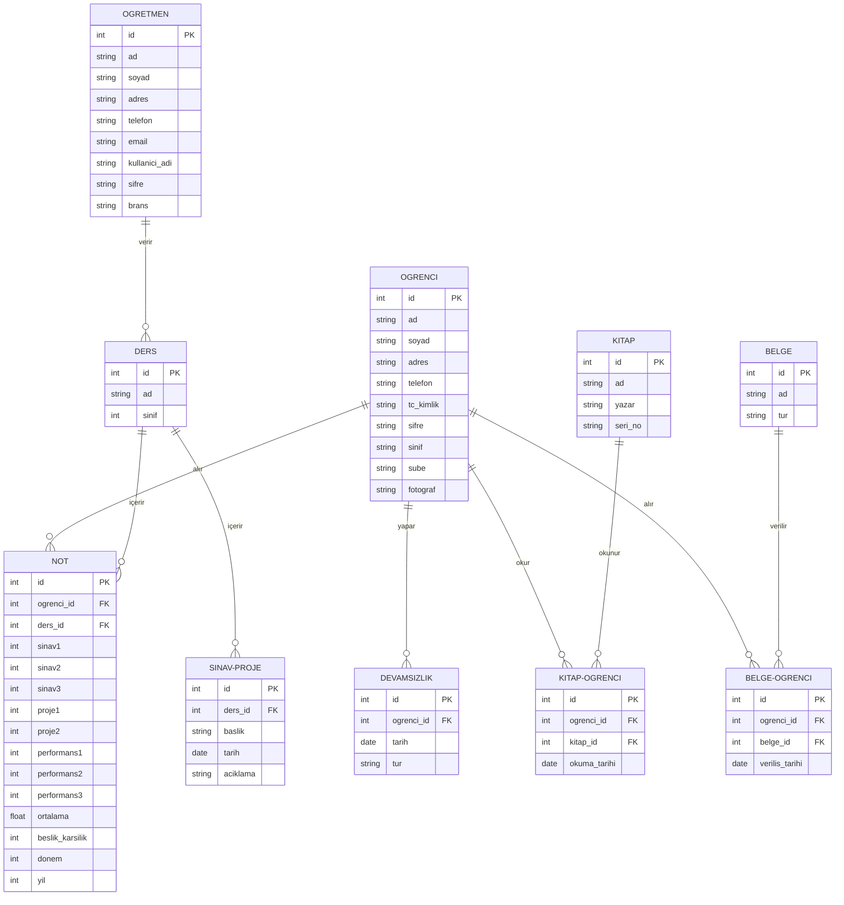

# Birim İlişki Diyagramı (ERD)

E-Okul Veli Bilgilendirme Sistemi'nin veritabanı tasarımını gösteren ERD diyagramı aşağıda verilmiştir.

## Açıklama

ERD diyagramı, sistemin veritabanı yapısını ve tablolar arasındaki ilişkileri göstermektedir. Sistem aşağıdaki temel tablolardan oluşmaktadır:

### Temel Tablolar

1. **Öğrenci Tablosu**
   - Öğrenci bilgileri
   - Kişisel bilgiler
   - İletişim bilgileri

2. **Not Tablosu**
   - Sınav notları
   - Proje notları
   - Performans notları
   - Ortalama hesaplamaları

3. **Devamsızlık Tablosu**
   - Devamsızlık kayıtları
   - Devamsızlık türleri
   - Tarih bilgileri

4. **Kitap-Öğrenci Tablosu**
   - Kitap okuma kayıtları
   - Okuma tarihleri
   - Kitap bilgileri

5. **Belge-Öğrenci Tablosu**
   - Belge kayıtları
   - Veriliş tarihleri
   - Belge bilgileri

6. **Öğretmen Tablosu**
   - Öğretmen bilgileri
   - İletişim bilgileri
   - Branş bilgileri

7. **Ders Tablosu**
   - Ders bilgileri
   - Sınıf bilgileri

8. **Kitap Tablosu**
   - Kitap bilgileri
   - Yazar bilgileri
   - Seri numaraları

9. **Belge Tablosu**
   - Belge bilgileri
   - Belge türleri

10. **Sınav-Proje Tablosu**
    - Sınav bilgileri
    - Proje bilgileri
    - Tarih bilgileri 