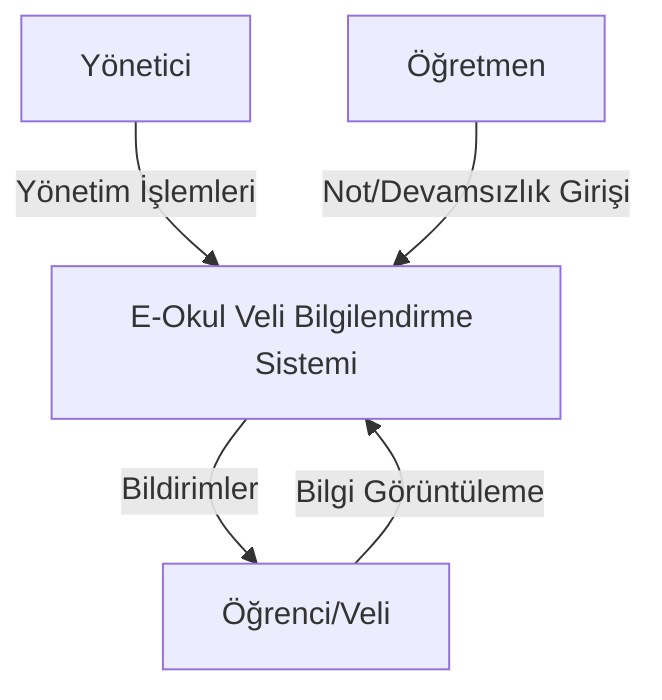

# Kaba İlişki Diyagramı (Context Diagram)

E-Okul Veli Bilgilendirme Sistemi'nin çevresiyle olan ilişkilerini gösteren kaba ilişki diyagramı aşağıda verilmiştir.

## Açıklama

Kaba ilişki diyagramı, sistemin çevresiyle olan temel ilişkilerini göstermektedir. Sistem üç temel kullanıcı grubu ile etkileşim halindedir:

### Kullanıcı Grupları

1. **Yönetici**
   - Sistem yönetimi
   - Kullanıcı yönetimi
   - Raporlama
   - Sistem ayarları

2. **Öğretmen**
   - Not girişi
   - Devamsızlık girişi
   - Kitap kaydı
   - Belge kaydı

3. **Öğrenci/Veli**
   - Not görüntüleme
   - Devamsızlık görüntüleme
   - Kitap listesi görüntüleme
   - Belge listesi görüntüleme
   - Duyuru görüntüleme 