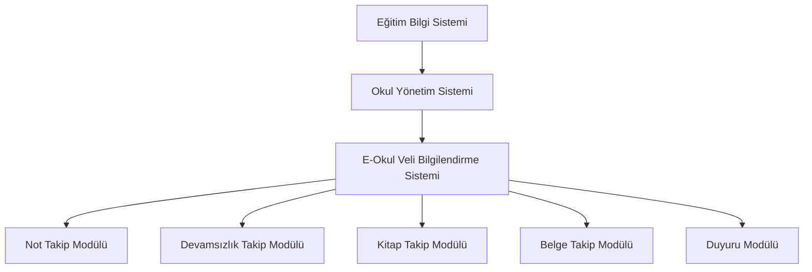

# Genel Sistem İçerisindeki Yeri

E-Okul Veli Bilgilendirme Sistemi, genel Eğitim Bilgi Sistemi içerisinde Okul Yönetim Sistemi'nin bir alt modülü olarak konumlandırılmıştır.

## Açıklama

E-Okul Veli Bilgilendirme Sistemi, Eğitim Bilgi Sistemi'nin en alt seviyesinde yer alan bir modüldür. Sistem, öğrencilerin akademik ve sosyal gelişimlerini takip etmek için gerekli tüm bilgileri içermektedir.

### Alt Modüller

1. **Not Takip Modülü**: Öğrencilerin sınav, proje ve performans notlarının kaydedilmesi ve takibi
2. **Devamsızlık Takip Modülü**: Öğrencilerin okula devam durumlarının kaydedilmesi ve takibi
3. **Kitap Takip Modülü**: Öğrencilerin okuduğu kitapların kaydedilmesi ve takibi
4. **Belge Takip Modülü**: Öğrencilerin aldığı belgelerin kaydedilmesi ve takibi
5. **Duyuru Modülü**: Okul yönetiminin duyurularının paylaşılması ve takibi 