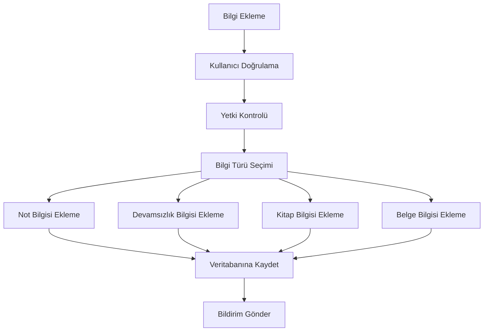

# Bilgi Ekleme Alt Seviye Diyagramı

E-Okul Veli Bilgilendirme Sistemi'nde bilgi ekleme sürecini gösteren alt seviye diyagramı aşağıda verilmiştir.

## Açıklama

Bilgi ekleme süreci, sistemde yeni bilgi girişi yapılmasını sağlayan temel süreçlerden biridir. Bu süreç aşağıdaki adımlardan oluşmaktadır:

### Süreç Adımları

1. **Kullanıcı Doğrulama**
   - Kullanıcı girişi kontrolü
   - Oturum doğrulama
   - Güvenlik kontrolü

2. **Yetki Kontrolü**
   - Kullanıcı yetkilerinin kontrolü
   - İşlem izinlerinin kontrolü
   - Erişim kısıtlamalarının kontrolü

3. **Bilgi Türü Seçimi**
   - Not bilgisi
   - Devamsızlık bilgisi
   - Kitap bilgisi
   - Belge bilgisi

4. **Bilgi Ekleme İşlemleri**
   - Not bilgisi ekleme
   - Devamsızlık bilgisi ekleme
   - Kitap bilgisi ekleme
   - Belge bilgisi ekleme

5. **Veritabanı İşlemleri**
   - Veri doğrulama
   - Veritabanına kaydetme
   - İşlem loglarının tutulması

6. **Bildirim İşlemleri**
   - İlgili kullanıcılara bildirim gönderme
   - Bildirim kayıtlarının tutulması 