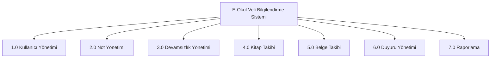

# 0-Seviye Diyagramı (Overview Diagram)

E-Okul Veli Bilgilendirme Sistemi'nin temel süreçlerini gösteren 0-seviye diyagramı aşağıda verilmiştir.

## Açıklama

0-seviye diyagramı, sistemin temel süreçlerini göstermektedir. Her bir süreç numaralandırılmış ve detaylı olarak açıklanmıştır:

### Temel Süreçler

1. **Kullanıcı Yönetimi (1.0)**
   - Kullanıcı kaydı
   - Kullanıcı güncelleme
   - Yetkilendirme
   - Şifre yönetimi

2. **Not Yönetimi (2.0)**
   - Not girişi
   - Not güncelleme
   - Not görüntüleme
   - Ortalama hesaplama

3. **Devamsızlık Yönetimi (3.0)**
   - Devamsızlık girişi
   - Devamsızlık güncelleme
   - Devamsızlık görüntüleme
   - Devamsızlık raporlama

4. **Kitap Takibi (4.0)**
   - Kitap kaydı
   - Okuma takibi
   - Kitap listesi
   - Okuma raporu

5. **Belge Takibi (5.0)**
   - Belge kaydı
   - Belge güncelleme
   - Belge görüntüleme
   - Belge raporu

6. **Duyuru Yönetimi (6.0)**
   - Duyuru oluşturma
   - Duyuru güncelleme
   - Duyuru görüntüleme
   - Bildirim gönderme

7. **Raporlama (7.0)**
   - Akademik raporlar
   - Devamsızlık raporları
   - Kitap okuma raporları
   - Belge raporları 