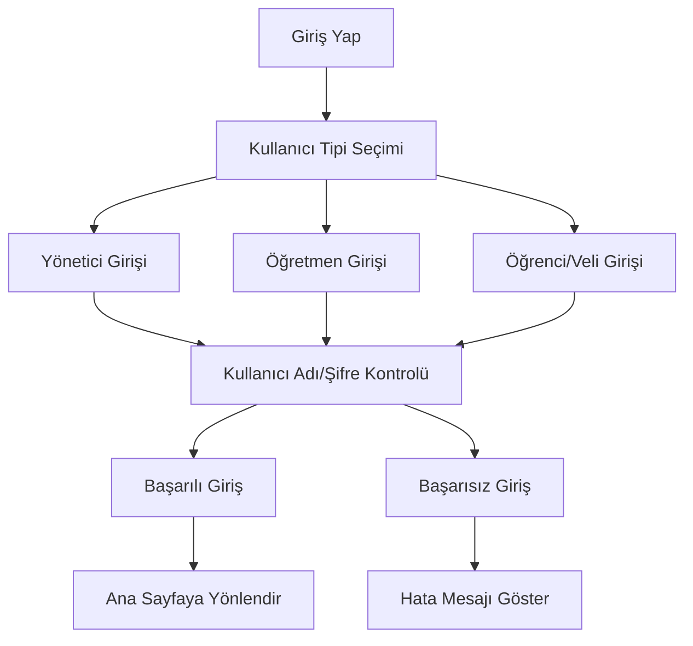

# Giriş Yapma Alt Seviye Diyagramı

E-Okul Veli Bilgilendirme Sistemi'nde giriş yapma sürecini gösteren alt seviye diyagramı aşağıda verilmiştir.

## Açıklama

Giriş yapma süreci, sistemin güvenliğini sağlayan temel süreçlerden biridir. Bu süreç aşağıdaki adımlardan oluşmaktadır:

### Süreç Adımları

1. **Kullanıcı Tipi Seçimi**
   - Yönetici girişi
   - Öğretmen girişi
   - Öğrenci/Veli girişi

2. **Kimlik Doğrulama**
   - Kullanıcı adı kontrolü
   - Şifre kontrolü
   - Güvenlik doğrulaması

3. **Giriş Sonucu**
   - Başarılı giriş
     - Ana sayfaya yönlendirme
     - Oturum başlatma
     - Yetkilendirme
   - Başarısız giriş
     - Hata mesajı gösterme
     - Yeniden deneme imkanı
     - Güvenlik önlemleri

4. **Güvenlik Önlemleri**
   - Şifre sıfırlama
   - Hesap kilitleme
   - Güvenlik logları
   - IP kontrolü 