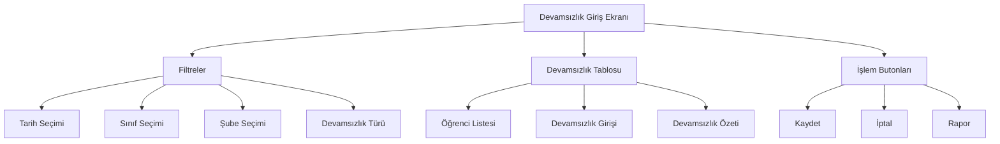

# Devamsızlık Giriş Ekranı Tasarımı

## Ekran Görünümü

## Ekran Bileşenleri

### 1. Filtreler Bölümü
- **Tarih Seçimi**
  - Date picker
  - Bugünün tarihi varsayılan
  - Geçmiş tarih seçilemez

- **Sınıf Seçimi**
  - Dropdown menü
  - Tüm sınıflar listesi
  - Varsayılan: Boş

- **Şube Seçimi**
  - Dropdown menü
  - Seçili sınıfa göre şubeler
  - Varsayılan: Boş

- **Devamsızlık Türü**
  - Radio butonlar
  - Seçenekler:
    - Özürlü
    - Özürsüz
    - İzinli
  - Varsayılan: Özürlü

### 2. Devamsızlık Tablosu
- **Öğrenci Listesi**
  - Tablo başlıkları:
    - No
    - Öğrenci No
    - Ad Soyad
    - Devamsızlık Durumu
    - Toplam Devamsızlık
    - Özürlü
    - Özürsüz
    - İzinli

- **Devamsızlık Girişi**
  - Checkbox
  - Tarih seçimi
  - Tür seçimi
  - Açıklama alanı

- **Devamsızlık Özeti**
  - Özet kartları:
    - Günlük Devamsız
    - Haftalık Devamsız
    - Aylık Devamsız
    - Yıllık Devamsız

### 3. İşlem Butonları
- **Kaydet Butonu**
  - Primary button
  - İkon: Save
  - Loading state

- **İptal Butonu**
  - Secondary button
  - İkon: Cancel
  - Form temizleme

- **Rapor Butonu**
  - Tertiary button
  - İkon: Report
  - PDF çıktı

## Tasarım Özellikleri

### Renkler
- Primary: #1976D2 (Mavi)
- Secondary: #424242 (Gri)
- Background: #F5F5F5 (Açık Gri)
- Table Header: #E3F2FD (Açık Mavi)
- Table Row: #FFFFFF (Beyaz)
- Success: #388E3C (Yeşil)
- Warning: #F57C00 (Turuncu)
- Error: #D32F2F (Kırmızı)

### Yazı Tipleri
- Başlık: Roboto Bold, 20px
- Alt Başlık: Roboto Medium, 16px
- Tablo Başlık: Roboto Medium, 14px
- Tablo İçerik: Roboto Regular, 14px
- Input: Roboto Regular, 14px

### Boşluklar
- Dış Padding: 24px
- Bileşenler Arası: 16px
- Tablo Hücre: 12px
- Input Padding: 8px

### Responsive Tasarım
- Mobile: Dikey tablo
- Tablet: Yatay kaydırmalı tablo
- Desktop: Tam genişlik tablo

## Kullanıcı Etkileşimleri

### 1. Filtre Seçimleri
- Tarih seçimi kontrolü
- Sınıf seçildiğinde şube listesi güncelleme
- Şube seçildiğinde öğrenci listesi güncelleme

### 2. Devamsızlık Girişi
- Checkbox ile hızlı işaretleme
- Toplu işaretleme
- Anlık özet güncelleme

### 3. Tablo İşlemleri
- Sıralama
- Filtreleme
- Arama

### 4. Kaydetme İşlemi
- Toplu kaydetme
- Tekil kaydetme
- Hata kontrolü

## Validasyon Kuralları

### 1. Tarih Kontrolü
- Geçmiş tarih seçilemez
- Gelecek tarih seçilemez
- Hafta sonu seçilemez

### 2. Devamsızlık Türü
- En az bir tür seçilmeli
- Çoklu seçim yapılamaz
- Açıklama zorunlu

### 3. Öğrenci Seçimi
- En az bir öğrenci seçilmeli
- Tüm sınıf seçilebilir
- Tekil seçim yapılabilir

### 4. Limit Kontrolleri
- Günlük limit: 6 ders
- Haftalık limit: 30 ders
- Yıllık limit: 180 ders

## Hata Mesajları

### 1. Tarih Seçimi
- "Geçmiş tarih seçilemez"
- "Gelecek tarih seçilemez"
- "Hafta sonu seçilemez"

### 2. Filtre Seçimi
- "Lütfen sınıf seçiniz"
- "Lütfen şube seçiniz"
- "Lütfen devamsızlık türü seçiniz"

### 3. Kaydetme
- "Kaydetme işlemi başarısız"
- "Lütfen en az bir öğrenci seçiniz"
- "Bağlantı hatası"

## Erişilebilirlik

### 1. Klavye Navigasyonu
- Tab ile alanlar arası geçiş
- Enter ile kaydetme
- Esc ile iptal

### 2. Screen Reader
- ARIA etiketleri
- Tablo açıklamaları
- Form etiketleri

### 3. Renk Kontrastı
- WCAG 2.1 standartları
- Minimum 4.5:1 oranı
- Renk körlüğü desteği

### 4. Font Boyutları
- Minimum 14px
- Responsive ölçeklendirme
- Zoom desteği

## Performans Optimizasyonu

### 1. Veri Yükleme
- Sayfalama
- Lazy loading
- Önbellek kullanımı

### 2. Hesaplamalar
- Client-side hesaplama
- Debounce kullanımı
- Batch işlemler

### 3. API İstekleri
- Batch kaydetme
- Önbellek stratejisi
- Hata yönetimi

### 4. Responsive Performans
- Mobil optimizasyon
- Tablet optimizasyon
- Desktop optimizasyon 