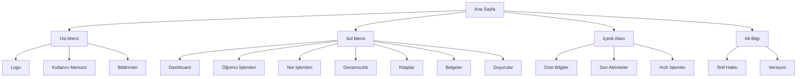

# Ana Sayfa Tasarımı

## Ekran Görünümü

## Ekran Bileşenleri

### 1. Üst Menü
- **Logo**
  - Sol üst köşe
  - Tıklanabilir (Ana sayfaya dönüş)
  - Responsive boyutlandırma

- **Kullanıcı Menüsü**
  - Sağ üst köşe
  - Kullanıcı adı ve rolü
  - Dropdown menü
    - Profil
    - Ayarlar
    - Çıkış

- **Bildirimler**
  - Sağ üst köşe
  - Bildirim sayısı göstergesi
  - Dropdown menü
    - Okunmamış bildirimler
    - Tüm bildirimler

### 2. Sol Menü
- **Dashboard**
  - İkon ve metin
  - Aktif sayfa vurgusu

- **Öğrenci İşlemleri**
  - Alt menüler
    - Öğrenci Listesi
    - Öğrenci Ekle
    - Öğrenci Düzenle

- **Not İşlemleri**
  - Alt menüler
    - Not Girişi
    - Not Listesi
    - Not Raporları

- **Devamsızlık**
  - Alt menüler
    - Devamsızlık Girişi
    - Devamsızlık Listesi
    - Devamsızlık Raporları

- **Kitaplar**
  - Alt menüler
    - Kitap Listesi
    - Kitap Ekle
    - Kitap Takip

- **Belgeler**
  - Alt menüler
    - Belge Listesi
    - Belge Ekle
    - Belge Takip

- **Duyurular**
  - Alt menüler
    - Duyuru Listesi
    - Duyuru Ekle
    - Duyuru Düzenle

### 3. İçerik Alanı
- **Özet Bilgiler**
  - Kartlar halinde
    - Toplam Öğrenci
    - Toplam Öğretmen
    - Aktif Dersler
    - Son Sınavlar

- **Son Aktiviteler**
  - Liste görünümü
    - Tarih
    - İşlem
    - Kullanıcı
    - Detay

- **Hızlı İşlemler**
  - Butonlar
    - Not Girişi
    - Devamsızlık Girişi
    - Duyuru Ekle
    - Rapor Al

### 4. Alt Bilgi
- **Telif Hakkı**
  - Sol alt köşe
  - Yıl ve kurum bilgisi

- **Versiyon**
  - Sağ alt köşe
  - Sistem versiyonu

## Tasarım Özellikleri

### Renkler
- Primary: #1976D2 (Mavi)
- Secondary: #424242 (Gri)
- Background: #F5F5F5 (Açık Gri)
- Card Background: #FFFFFF (Beyaz)
- Text: #212121 (Koyu Gri)
- Success: #388E3C (Yeşil)
- Warning: #F57C00 (Turuncu)
- Error: #D32F2F (Kırmızı)

### Yazı Tipleri
- Başlık: Roboto Bold, 20px
- Alt Başlık: Roboto Medium, 16px
- Normal Metin: Roboto Regular, 14px
- Menü: Roboto Medium, 14px

### Boşluklar
- Dış Padding: 24px
- Kartlar Arası: 16px
- İç Padding: 16px
- Menü Öğeleri: 12px

### Responsive Tasarım
- Mobile: Tek kolon
- Tablet: İki kolon
- Desktop: Üç kolon

## Kullanıcı Etkileşimleri

### 1. Menü Navigasyonu
- Hover efektleri
- Aktif sayfa vurgusu
- Alt menü açılma/kapanma

### 2. Bildirimler
- Okunmamış bildirim vurgusu
- Bildirim okundu işaretleme
- Tümünü okundu işaretleme

### 3. Hızlı İşlemler
- Hover efektleri
- Tıklama animasyonları
- İşlem sonrası geri bildirim

### 4. Kartlar
- Hover efektleri
- Tıklanabilir kartlar
- Detay görüntüleme

## Erişilebilirlik

### 1. Klavye Navigasyonu
- Tab ile menü geçişi
- Alt menü açma/kapama
- Kısayol tuşları

### 2. Screen Reader
- ARIA etiketleri
- Alt textler
- Menü açıklamaları

### 3. Renk Kontrastı
- WCAG 2.1 standartları
- Minimum 4.5:1 oranı
- Renk körlüğü desteği

### 4. Font Boyutları
- Minimum 14px
- Responsive ölçeklendirme
- Zoom desteği

## Performans Optimizasyonu

### 1. Sayfa Yüklenme
- Lazy loading
- Önbellek kullanımı
- Resim optimizasyonu

### 2. Veri Yönetimi
- Sayfalama
- Filtreleme
- Arama optimizasyonu

### 3. API İstekleri
- Batch işlemler
- Önbellek stratejisi
- Hata yönetimi

### 4. Responsive Performans
- Mobil optimizasyon
- Tablet optimizasyon
- Desktop optimizasyon 